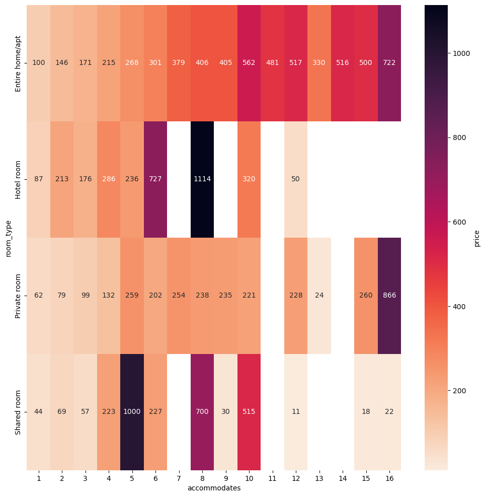
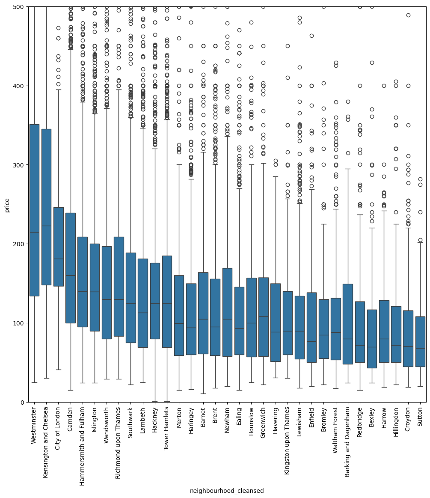

# How I find the best AirBnB Accommodation as an NLP Data Scientist


If you have ever made an AirBnB booking, you're familiar with the variety of options that AirBnB offers. From cozy apartments to luxurious villas, how do you decide which one is the best for you?

One way to do that is to read the reviews that previous guests have left for the listings. However, reading through hundreds or thousands of reviews can also be very time-consuming and boring. That’s why I decided to use natural language processing (NLP) to analyse and summarize AirBnB reviews.

In this blog post, I will share with you how I use NLP to find the best AirBnB accommodation for an example trip to London, UK. I will show you how I perform some data analysis to find some trends and patterns in the listings, how I used a state-of-the-art NLP models to summarize the reviews, and how I use the summaries to compare and choose the best listing for my preferences and budget.

## Exploratory Data Analysis
The first step of the project was to get the data. I used a dataset of AirBnB listings and reviews which I obtained from [Inside AirBnB](http://insideairbnb.com/get-the-data.html). The dataset contained information about more than 80,000 listings and more than 1.5 million reviews.

Before diving deep into the reviews, I performed some exploratory data analysis on the dataset. I wanted to find some basic statistics based on my travel needs. For this post, I am assuming that I will be travelling with the following preferences:
- Party of 2
- 1 bathroom will suffice
- Near major attractions (< 30 mins public transport) 
- Reasonably priced (< 1.5x average price per night)
- Low noise neighbourhood as we are light sleepers

Using the correlation between the different factors and price, we can determine the factors which has the largest impact on the price.

```
>>> Price Correlation
>>> accommodates                                   0.421537
>>> beds                                           0.345322
>>> bathrooms                                      0.335523
>>> calculated_host_listings_count_entire_homes    0.272089
>>> calculated_host_listings_count                 0.249292
>>> host_listings_count                            0.162451
>>> host_total_listings_count                      0.112173
>>> has_host_neighbourhood                         0.108942
>>> reviews_per_month                              0.107116
>>> number_of_reviews_l30d                         0.104555
>>> number_of_reviews_ltm                          0.104282
```

From the dataset, we can see that the price is mainly influenced by the following factors:
- Number of people the property accommodates (# of beds)
- Number of bathrooms
- Type of property (Private room, Entire home etc.)
- Number of other listings by host
- Neighbourhood
- Number of Reviews

Let's dive into these factors against the monthly revenue for these hosts. The reason monthly revenue is used instead of price is because prices which are set by hosts may not reflect the actual value of the property (i.e. some hosts may have a extremely low priced listing but is never available).


 

From the graphs above, we can see that the price of the properties seem to follow a linear relationship to the number of people the property accomodates up to 8 people. Therefore, if I had a friend who was thinking of joining the trip, I do not have to worry about the increase in property price. However, if we look at the heatmap, we can see that having 3 people instead of 2 would reduce our number of options by ~80% as there were significantly more options for an even number of people. Thus, I might have to think twice before inviting any single friends. 



If we compare the prices for an entire home and a private room, we can see that the price for an entire home is about 1.8x the price of a private room for 2 persons. Since the price of an entire home is ~1.3x the average price for 2 persons, I can choose to look for entire homes instead of just a private bedroom. 

<p float="middle">
  
   
</p>

In terms of location, Westminster is the neighbourhood with the most expensive region followed by Kensington and Chelsea, City of London, Camden, and Hammersmith and Fulham. We can also see that locations like Lambeth, Southwark, Islington and Hackney have the lowest number of availabity. This tells us that these locations are popular among customers. Based on this, we can make a balance in terms of how much we are willing to spend and distance away from the attractions. To identify this, we can use coordinates to get a price against distance graph. However, this is out of the scope of this investigation.


Putting everything together, we can determine the average price for a property which accomodates 2 persons, has 1 bathroom. Based on the boxplot above, I can budget to spend approximately £80 to £100 per night depending on the neighbourhood. 

## Review Score Correlation
A common metric that many customers (myself included) look at when making their decision is the property's rating. However, let's have a look at how well the rating correlate to the reviews.

Using a pre-trained sentence embedding model, we can extract sentence embeddings from the reviews. These sentence embeddings are essentiallly numerical representations of the sentences which we can use to determine the correlation between the written reviews and the given review scores. Since the review scores available in the dataset is on a per listing basis, we combine the review embeddings by taking its mean. 

```
>>> Model: LinearRegression
>>> Task: review_scores_rating
>>> R^2 Score: 0.5553335926082361
>>> Mean Squared Error: 0.13949429520739484
>>> Pearson Correlation Coefficient: 0.7499294259616659
```

Using the LinearRegression (Ordinary Least Squares) method, we get a Pearson Correlation Coefficient of 0.7492 and a R^2 score of 0.5553 indicating that 55.53% of the ratings can be explained through the review embeddings. This fairly weak correlation suggests that we can use this review score as a rough indication of the past guest experiences for the listing but should not treat the score as an absolute measure. 

## Review Summarization

At this stage, I am usually left with a couple of listings that I would like to compare. Reading each of the reviews for the listings would provide me a great idea of past customer experiences. However, this process is extremely time consuming. Therefore, in this section we use a LLM to summarize the reviews on a per listing basis. 

Mistral 7B Instruct is used as a pre-trained model to summarize the reviews. To begin, we combine all the reviews based on the listing id into a long string of text. The following prompts are then passed to the model along with the reviews.

```
positive_prompt = f"""Below is an instruction that describes a task. Write a response that appropriately completes the request.

### Instruction:
Based on the reviews below, identify five distinct aspects that the customers liked about the property. Return the result as up to five bullet points.

### Reviews: {reviews}

### Response:
"""

negative_prompt = f"""Below is an instruction that describes a task. Write a response that appropriately completes the request.
### Instruction:
Based on the reviews below, identify distinct aspects that the customers disliked about the property. Return the result as up to five bullet points.

### Reviews: {reviews}

### Response:
"""
```

A sample of the resulting summary are as follows:

**Strengths**
* Friendly and accommodating host
* Comfortable and quiet neighborhood with excellent eateries
* Diverse with excellent ethnic eateries and good supermarkets
* Dependable transportation links
* Generous and helpful with support in finding permanent accommodation in London accommodation in London.

**Weaknesses**
* The property is located in a significant distance from downtown London attractions
* lacks adequate noise insulation in some reviews 
* lacks mention of air conditioning or heating
* no mention of long-decorated interior
* no specific information about amenities or facilities or specific information about parking.

This saves significant amount of time as it provides us with a quick summary of previous reviews which we can use to identify if the property is suitable based on our needs. 

## Conclusion
Using some statistics, we can see how data science can help narrow down the number of listings we have to go through manually. We've also seen how a weak correlation between the listing's scores and their reviews indicate that we should take the scores with a pinch of salt. Lastly, we've also shown how we can use LLMs to reduce the amount of time spent on reading reviews for listings.